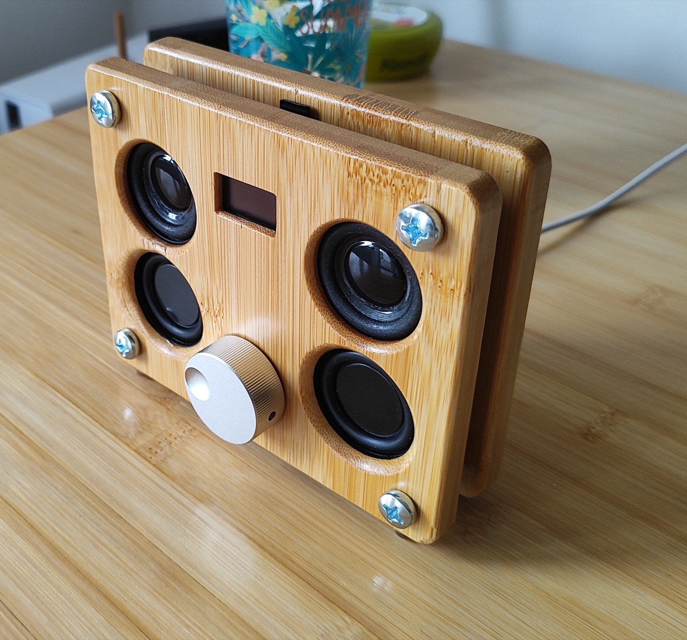
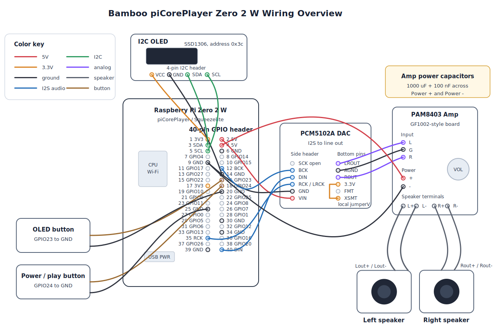

# Bamboo piCorePlayer Zero 2 W OLED



A small Wi-Fi Squeezelite player built with piCorePlayer, a Raspberry Pi Zero 2 W, a PCM5102A I2S DAC, a PAM8403-style stereo amplifier, passive speakers, and a tiny I2C OLED display.

The build is designed as a network player for Logitech Media Server (LMS) running elsewhere on the LAN.

## Wiring Diagram



```text
LMS server
    -> Wi-Fi
Raspberry Pi Zero 2 W + piCorePlayer
    -> I2S
PCM5102A DAC
    -> analog L/R
PAM8403-style amplifier
    -> 2x passive speakers
```

## Hardware

- Raspberry Pi Zero 2 W
- PCM5102A I2S DAC module
- GF1002 / PAM8403-style stereo amplifier board with volume knob
- 2x 8 ohm passive speakers
- 0.96-1 inch SSD1306-style I2C OLED, address `0x3c`
- 2x normally-open tactile buttons
- 1000 uF electrolytic capacitor and 100 nF ceramic capacitor across amplifier power

## Raspberry Pi Header

Header viewed from above, pin 1 top-left:

```text
 3V3   (1) (2)  5V
 GPIO2 (3) (4)  5V
 GPIO3 (5) (6)  GND
 GPIO4 (7) (8)  GPIO14
 GND   (9) (10) GPIO15
GPIO17 (11)(12) GPIO18
GPIO27 (13)(14) GND
GPIO22 (15)(16) GPIO23
 3V3   (17)(18) GPIO24
GPIO10 (19)(20) GND
 GPIO9 (21)(22) GPIO25
GPIO11 (23)(24) GPIO8
 GND   (25)(26) GPIO7
 GPIO0 (27)(28) GPIO1
 GPIO5 (29)(30) GND
 GPIO6 (31)(32) GPIO12
GPIO13 (33)(34) GND
GPIO19 (35)(36) GPIO16
GPIO26 (37)(38) GPIO20
 GND   (39)(40) GPIO21
```

## Wiring

### Pi Zero 2 W to PCM5102A DAC

```text
Pi pin 2  / 5V                -> DAC VIN
Pi pin 6 or 39 / GND          -> DAC GND
Pi pin 12 / GPIO18 / PCM_CLK  -> DAC BCK
Pi pin 35 / GPIO19 / PCM_FS   -> DAC RCK / LRCK
Pi pin 40 / GPIO21 / PCM_DOUT -> DAC DIN
```

Leave `DAC SCK` unconnected.

On this PCM5102A board, `XSMT` must be pulled high or the DAC remains muted:

```text
DAC XSMT -> DAC 3.3V
```

Do not connect `XSMT` to 5V.

### DAC to Amplifier

```text
DAC LROUT -> amp L
DAC AGND  -> amp G
DAC ROUT  -> amp R
```

Use `AGND` for analog audio ground.

### Amplifier Power

```text
Amp Power + -> Pi physical pin 4 / 5V
Amp Power - -> Pi physical pin 9 / GND
```

Add capacitors directly across the amplifier power terminals:

```text
1000 uF / 16V electrolytic
100 nF ceramic capacitor, often marked 104
```

Polarity:

```text
Electrolytic +        -> amp Power +
Electrolytic - stripe -> amp Power -
104 ceramic           -> no polarity
```

### Speakers

```text
Amp Lout+ / Lout- -> left 8 ohm speaker
Amp Rout+ / Rout- -> right 8 ohm speaker
```

Do not connect speaker minus to Pi GND. PAM8403-style amplifier outputs are bridged outputs.

### OLED

```text
OLED VCC -> Pi pin 1  / 3.3V
OLED GND -> Pi pin 14 / GND
OLED SDA -> Pi pin 3  / GPIO2 / SDA
OLED SCL -> Pi pin 5  / GPIO3 / SCL
```

### Buttons

Both buttons are normally open and wired from GPIO to GND. With pull-ups enabled:

```text
not pressed = 1
pressed     = 0
```

OLED toggle button:

```text
Button leg 1 -> Pi pin 16 / GPIO23
Button leg 2 -> Pi pin 20 / GND
```

LMS power/play button:

```text
Button leg 1 -> Pi pin 18 / GPIO24
Button leg 2 -> Pi pin 25 / GND
```

On this piCorePlayer kernel the sysfs GPIO base is `512`, so:

```text
GPIO23 -> /sys/class/gpio/gpio535
GPIO24 -> /sys/class/gpio/gpio536
```

Check your own base with:

```sh
ls /sys/class/gpio/gpiochip*
```

## piCorePlayer Setup

In the piCorePlayer web UI, select:

```text
HiFiBerry DAC Zero/MiniAMP
```

This should expose the ALSA card as:

```text
sndrpihifiberry
```

Useful checks:

```sh
cat /proc/asound/cards
aplay -l
```

Speaker test:

```sh
sudo killall -9 squeezelite 2>/dev/null
speaker-test -D sysdefault:CARD=sndrpihifiberry -c 2 -t wav
```

If needed, this output device is also useful:

```text
plughw:CARD=sndrpihifiberry,DEV=0
```

The normal piCorePlayer safe speaker test may fail with:

```text
Error: No suitable mixer control found for card sndrpihifiberry
```

That is expected for simple I2S DACs without a hardware mixer.

## Boot Config

Mount the boot partition if needed:

```sh
sudo mkdir -p /mnt/mmcblk0p1
sudo mount /dev/mmcblk0p1 /mnt/mmcblk0p1
```

Edit:

```sh
sudo vi /mnt/mmcblk0p1/config.txt
```

Useful lines:

```text
dtparam=i2c_arm=on
gpio=23=ip,pu
gpio=24=ip,pu
```

piCorePlayer can manage the HiFiBerry DAC overlay through the web UI. If configuring manually, the relevant overlay family is:

```text
dtoverlay=hifiberry-dac
```

The onboard Pi audio can be disabled/commented if needed:

```text
#dtparam=audio=on
```

## I2C

Load the I2C device module:

```sh
sudo modprobe i2c-dev
```

Install I2C tools if needed:

```sh
tce-load -wi i2c-tools.tcz
```

Scan:

```sh
i2cdetect -y 1
```

Expected OLED result:

```text
30: -- -- -- -- -- -- -- -- -- -- -- -- 3c -- -- --
```

To load `i2c-dev` automatically, add this to `/opt/bootlocal.sh`:

```sh
modprobe i2c-dev
```

## OLED / LMS Script

The script is in [oled_lms_power.py](oled_lms_power.py).

It displays:

- date/time and LMS software volume
- artist/station
- title/current radio metadata

Button behavior:

- OLED button toggles display off/on without stopping playback
- power/play button powers on and plays if the player is off, plays if paused/stopped, and powers off the LMS player if currently playing

The script talks to LMS over the CLI port, usually `9090`. Find your player ID:

```sh
printf "players 0 20\nexit\n" | nc <lms-host> 9090
```

The `playerid` immediately before the desired `name` is the value to use.

Configure the script either by editing the constants at the top or with environment variables:

```sh
export LMS_HOST=<LMS_HOST>
export PLAYER_ID=<PLAYER_ID>
export PLAYER_NAME=<PLAYER_NAME>
```

Manual test:

```sh
sudo modprobe i2c-dev
python3 /home/tc/oled/oled_lms_power.py
```

Autostart example for `/opt/bootlocal.sh`:

```sh
modprobe i2c-dev

(
  sleep 30
  modprobe i2c-dev
  LMS_HOST=<LMS_HOST> \
  PLAYER_ID=<PLAYER_ID> \
  PLAYER_NAME=<PLAYER_NAME> \
  /usr/local/bin/python3 /home/tc/oled/oled_lms_power.py >/tmp/oled_lms.log 2>&1 &
) &
```

## TinyCore Persistence

piCorePlayer/TinyCore does not persist arbitrary files unless they are included in the backup list.

Copy the script:

```sh
mkdir -p /home/tc/oled
cp oled_lms_power.py /home/tc/oled/oled_lms_power.py
```

Add it to persistence:

```sh
grep home/tc/oled /opt/.filetool.lst || echo "home/tc/oled" >> /opt/.filetool.lst
filetool.sh -b
```

After any final config or script change:

```sh
filetool.sh -b
```

## Troubleshooting

### ALSA card exists but no sound

Check:

```text
DAC XSMT -> 3.3V
Pi pin 12 -> DAC BCK
Pi pin 35 -> DAC RCK / LRCK
Pi pin 40 -> DAC DIN
DAC VIN/GND powered
```

If `XSMT` reads 0V, the DAC is muted.

### DAC headphones work but speakers do not

Check:

```text
DAC LROUT -> amp L
DAC AGND  -> amp G
DAC ROUT  -> amp R
Amp Power + -> 5V
Amp Power - -> GND
Amp knob clicked on
Speakers connected to Lout/Rout pairs
```

Unplug headphones from the DAC while testing speakers; some 3.5 mm jacks may mute or load the line outputs.

### Pi reboots when amplifier turns on

Add or check the amplifier power capacitors:

```text
1000 uF / 16V electrolytic + 100 nF ceramic across amp Power + and Power -
```

Use a solid 5V power supply. The Zero 2 W draws more current than the original Zero W.

### OLED detected but blank

Check that the script being started is the same file you edited:

```sh
ps | grep oled | grep -v grep
cat /tmp/oled_lms.log
```

Run in foreground:

```sh
python3 /home/tc/oled/oled_lms_power.py
```

### Button does not react

Check the sysfs base and GPIO values:

```sh
ls /sys/class/gpio/gpiochip*
cat /sys/class/gpio/gpio535/value
cat /sys/class/gpio/gpio536/value
```

Expected:

```text
not pressed = 1
pressed     = 0
```
